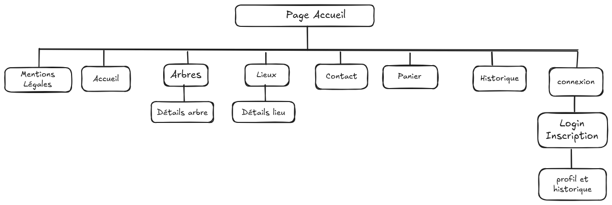

# GreenRoots !!

## Présentation Générale

- **Quoi ?** Développement d'une plateforme d'e-commerce permettant d'acheter des arbres à planter (par GreenRoots et demain des associations tierces) pour contribuer à la reforestation.
- **Qui ?** GreenRoots (fictif) est née de l’urgence de prendre des mesures concrètes pour préserver notre planète face à la déforestation et au changement climatique.
- **Pour qui ?** Public éco-conscient, entreprises responsables, associations engagées, etc.
- **Comment ?** En équipe : Armand, Zakaria, Anne-Sophie. Organisation en méthode agile pour la gestion de projet.
- **Quand ?** En plusieurs sprints qui incluront des tâches de : conception, code, déploiement, recettage, etc.

## Présentation du Projet de Développement

### Besoins Fonctionnels (Minimum Viable Product - MVP)

- Landing page avec la présentation de GreenRoots et certains arbres à planter.
- Système d'inscription et de connexion.
- Avoir la possibilité (en tant que GreenRoots) de gérer les arbres à proposer : création, édition, suppression, etc.
- Pouvoir consulter les détails d’un arbre disponible à l’achat.
- Pouvoir acheter un arbre (avec un faux tunnel d’achat pour le MVP).
- Pouvoir suivre ses commandes passées en tant qu’utilisateur.

### Propositions d’évolutions possibles

- Pouvoir suivre l’évolution des arbres que l’on a achetés : lieu, croissance, photos potentielles, etc.
- Back-office pour l'administration, la gestion des profils utilisateurs, le suivi des arbres, etc.
- Ajout de fonctionnalités avancées pour les partenaires : via un rôle spécifique, pouvoir proposer en tant qu’externe un lot d’arbres à planter, etc.
- Intégration d'une API pour le paiement sécurisé, comme [Stripe](https://stripe.com/fr).

### Contraintes Techniques

- **Technologies** : application monolithique :  
                              - express + ejs pour les views, 
                              - postgreSQL, 
                              - sequelize comme ORM. 
- **Sécurité :** authentification sécurisée, protection contre les failles courantes (XSS, injections SQL, etc.).
- **Déploiement :** rédaction a minima d'une procédure de déploiement (CI/CD en bonus).
- **Responsive :** application développée en mobile first et responsive.
- **Accessibilité :** respect des normes d'accessibilité web [WCAG](https://www.w3.org/Translations/WCAG20-fr/).
- **RGPD et mentions légales :** mettre en place les mentions légales liées au règlement général sur la protection des données (RGPD).
- **Versionning :** utilisation de Git et GitHub.
- **SEO** : appliquer les bonnes pratiques visant à maximiser le référencement du projet.
- **Navigateurs compatibles :** Chrome, Firefox, Brave.
- **Bonus** :
    - utilisation de Render pour le déploiement,
    - éco-conception (optimisation des images, minification des fichiers, etc.).

### Routes

#### L'arborescence des routes

#### Détail des routes

| Méthode | Route                     | Description                                      | Accès               |
|---------|---------------------------|--------------------------------------------------|---------------------|
| GET     | /                         | Page d'accueil                                   | Public              |
| GET     | /register                 | Page d'inscription                               | Public              |
| POST    | /register                 | Soumission du formulaire d'inscription           | Public              |
| GET     | /dashboard                | Page de profil et historique des arbres commandés| Utilisateur connecté|
| GET     | /login                    | Page de connexion                                | Public              |
| POST    | /login                    | Soumission du formulaire de connexion            | Public              |
| POST    | /logout                   | Déconnexion                                      | Utilisateur connecté|
| GET     | /trees                    | Liste des arbres disponibles à l'achat           | Public              |
| GET     | /trees/:id                | Détails d'un arbre spécifique                    | Public              |
| POST    | /trees/:id/buy            | Achat d'un arbre                                 | Utilisateur connecté|
| GET     | /place                    | Liste des lieux de plantation                    | Public              |
| GET     | /place/:id                | Détails d'un lieu de plantation                  | Public              |
| GET     | /panier                   | Panier                                           | Utilisateur connecté|
| POST    | /panier/add               | Ajout d'un arbre au panier                       | Utilisateur connecté|
| POST    | /panier/remove            | Retrait d'un arbre du panier                     | Utilisateur connecté|
| GET     | /panier/update            | Mise à jour du panier                            | Utilisateur connecté|
| POST    | /panier/validate          | Validation du panier et passage à la commande    | Utilisateur connecté|
| GET     | /panier/confirmation/:orderId| Confirmation de la commande                   | Utilisateur connecté|
| GET     | /contact                  | Contact                                          | Public              |
| GET     | /rgpd                     | Mentions légales et Politique de confidentialité| Public              |
| GET     | /dashboard                | Page d'admin                                     | Admin               |
| GET     | /trees/create             | Formulaire de création d'un arbre                | Admin               |
| POST    | /trees/create             | Ajout d'un arbre                                 | Admin               |
| GET     | /trees/:id/edit           | Formulaire de modification d'un arbre            | Admin               |
| POST    | /trees/:id/edit           | Modification d'un arbre                          | Admin               |
| POST  | /trees/:id/delete           | Suppression d'un arbre                           | Admin               |
| GET     | /place/create             | Formulaire de création d'un lieu de plantation   | Admin               |
| POST    | /place/create             | Ajout d'un lieu de plantation                    | Admin               |
| GET     | /place/:id/edit           | Formulaire de modification d'un lieu de plantation| Admin               |
| POST    | /place/:id/edit           | Modification d'un lieu de plantation             | Admin               |
| POST  | /place/:id/delete           | Suppression d'un lieu de plantation              | Admin               |
| GET     | /user                     | Voir d'un utilisateur                            | Admin               |
| GET     | /user/:id                 | Voir un utilisateur spécifique                   | Admin               |
| GET     | /user/:id/edit            | Formulaire de modification d'un utilisateur      | Admin               |
| POST    | /user/:id/edit            | Modification d'un utilisateur                    | Admin               |
| POST  | /user/:id/delete            | Suppression d'un utilisateur                     | Admin               |

#### User Stories

| Rôle | En tant que | Je veux pouvoir |
|---|---| ---|
| Utilisateur | En tant qu’utilisateur, | je veux pouvoir m’inscrire pour créer un compte. |
| Utilisateur | En tant qu’utilisateur, | je veux pouvoir me connecter à mon compte. |
| Utilisateur | En tant qu’utilisateur, | je veux pouvoir consulter la liste des arbres disponibles à l’achat. |
| Utilisateur | En tant qu’utilisateur, | je veux pouvoir voir les détails d’un arbre spécifique. |
| Utilisateur | En tant qu’utilisateur, | je veux pouvoir acheter un arbre. |
| Utilisateur | En tant qu’utilisateur, | je veux pouvoir consulter l’historique de mes commandes. |
| Utilisateur | En tant qu’utilisateur, | je veux pouvoir voir et modifier mon panier. |
| Utilisateur | En tant qu’utilisateur, | je veux pouvoir me déconnecter de mon compte. |
| Admin | En tant qu’admin, | je veux pouvoir ajouter de nouveaux arbres à la plateforme. |
| Admin | En tant qu’admin, | je veux pouvoir modifier les informations d’un arbre existant. |
| Admin | En tant qu’admin, | je veux pouvoir supprimer un arbre de la plateforme. |
| Admin | En tant qu’admin, | je veux pouvoir ajouter des lieux de plantation. |
| Admin | En tant qu’admin, | je veux pouvoir modifier les lieux de plantation. |
| Admin | En tant qu’admin, | je veux pouvoir supprimer des lieux de plantation. |
| Admin | En tant qu’admin, | je veux pouvoir voir les utilisateurs. |
| Admin | En tant qu’admin, | je veux pouvoir modifier les informations d’un utilisateur. |
| Admin | En tant qu’admin, | je veux pouvoir supprimer un utilisateur. |

#### Rôles de chacun :

- Product Owner (PO) : Armand
- Lead developer front : Zakaria
- Lead developer back : Anne-Sophie
- Git master : Armand

#### Organisation du travail

Mise en place d'un kanban où chacun choisira les tâches qu'il souhaite faire tout en restant équilibré entre les membres de l'équipe.