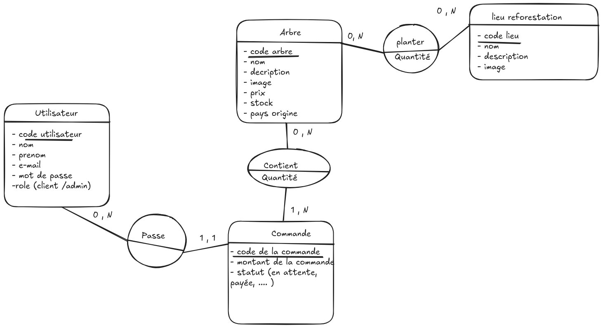

# MCD (Modèle Conceptuel de Données)



# MLD (Modèle Logique de Données)

USER (id, last_name, first_name, e-mail, password, role)<br>
USER_HAS_TREE (#user_id, #tree_id)<br>
ORDER (id, total_price, status, #user_id, created_at)<br>
ORDER_HAS_TREE (id, quantity, #tree_id, #order_id)<br>
TREE (id, name, description, image, price, stock, origin)<br>
PLACE_HAS_PLANT (id, quantity, #tree_id, #place_id) <br>
PLACE (id, name, description, image)<br>

# MPD (Modèle Physique de Données)

```sql
-- =============================
-- Table : USER
-- =============================
CREATE TABLE "user" (                             -- Création de la table des utilisateurs
    id SERIAL PRIMARY KEY,                        -- Identifiant unique auto-incrémenté (GENERATED ALWAYS AS IDENTITY)
    last_name TEXT NOT NULL,                      -- Nom de famille de l’utilisateur
    first_name TEXT NOT NULL,                     -- Prénom de l’utilisateur
    email TEXT UNIQUE NOT NULL,                   -- Email unique (sert aussi pour la connexion)
    password TEXT NOT NULL,                       -- Mot de passe de l’utilisateur (haché)
    role TEXT DEFAULT 'client'                    -- Rôle par défaut : "client"
         CHECK (role IN ('client', 'admin'))      -- Vérifie que le rôle est bien "client" ou "admin"
);

-- =============================
-- Table : PLACE
-- =============================
CREATE TABLE place (                              -- Création de la table des lieux de plantation
    id SERIAL PRIMARY KEY,                        -- Identifiant unique auto-incrémenté
    name TEXT NOT NULL  ,                         -- Nom du lieu (ex : Amazonie, Kenya, etc.)
    description TEXT,                             -- Description du lieu
    image TEXT                                    -- Lien vers une image du lieu
);

-- =============================
-- Table : TREE
-- =============================
CREATE TABLE tree (                               -- Création de la table des arbres
    id SERIAL PRIMARY KEY,                        -- Identifiant unique auto-incrémenté
    name TEXT NOT NULL,                           -- Nom de l’arbre (ex : Chêne, Olivier, etc.)
    description TEXT,                             -- Description de l’arbre
    image TEXT,                                   -- Lien vers une image de l’arbre
    price DECIMAL(10,2) NOT NULL,                 -- Prix de l’arbre
    stock INT NOT NULL,                           -- Quantité d’arbres disponibles
    origin TEXT,                                  -- Origine géographique (ex : France, Brésil)
    place_id INT REFERENCES place(id)             -- Lieu associé à l’arbre (clé étrangère)
             ON DELETE SET NULL                   -- Si le lieu est supprimé, la valeur devient NULL
);

-- =============================
-- Table : PLACE_HAS_PLANT
-- =============================
CREATE TABLE place_has_plant (                    -- Table d’association entre arbres et lieux
    id SERIAL PRIMARY KEY,                        -- Identifiant unique auto-incrémenté
    quantity INT DEFAULT 1 CHECK (quantity > 0),  -- Nombre d’arbres plantés (minimum 1)
    tree_id INT NOT NULL REFERENCES tree(id)      -- Clé étrangère vers l’arbre concerné
            ON DELETE CASCADE,                    -- Si l’arbre est supprimé → suppression automatique
    place_id INT NOT NULL REFERENCES place(id)    -- Clé étrangère vers le lieu concerné
            ON DELETE CASCADE                     -- Si le lieu est supprimé → suppression automatique
);

-- =============================
-- Table : ORDER
-- =============================
CREATE TABLE "order" (                            -- Création de la table des commandes
    id SERIAL PRIMARY KEY,                        -- Identifiant unique auto-incrémenté
    total_price DECIMAL(10,2) NOT NULL,           -- Montant total de la commande
    status TEXT NOT NULL,                         -- Statut de la commande (ex : payée, en attente)
    created_at TIMESTAMP DEFAULT CURRENT_TIMESTAMP,-- Date et heure de création de la commande (gérée par Sequelize)
    user_id INT REFERENCES "user"(id)             -- Lien vers l’utilisateur ayant passé la commande
            ON DELETE CASCADE                     -- Si l’utilisateur est supprimé → suppression des commandes
);

-- =============================
-- Table : ORDER_HAS_TREE
-- =============================
CREATE TABLE order_has_tree (                     -- Table d’association entre commande et arbre
    id SERIAL PRIMARY KEY,                        -- Identifiant unique auto-incrémenté
    quantity INT NOT NULL,                        -- Quantité d’arbres achetés dans la commande
    tree_id INT NOT NULL REFERENCES tree(id)      -- L’arbre concerné (clé étrangère)
            ON DELETE CASCADE,                    -- Si l’arbre est supprimé → suppression automatique
    order_id INT NOT NULL REFERENCES "order"(id)  -- Commande concernée (clé étrangère)
            ON DELETE CASCADE                     -- Si la commande est supprimée → suppression automatique
);

-- =============================
-- Table : USER_HAS_TREE
-- =============================
CREATE TABLE user_has_tree (                      -- Table de suivi : quels arbres un utilisateur a acheté
    user_id INT REFERENCES "user"(id)             -- L’utilisateur concerné (clé étrangère)
            ON DELETE CASCADE,                    -- Si l’utilisateur est supprimé → suppression automatique
    tree_id INT REFERENCES tree(id)               -- L’arbre concerné (clé étrangère)
            ON DELETE CASCADE                     -- Si l’arbre est supprimé → suppression automatique
);


```
